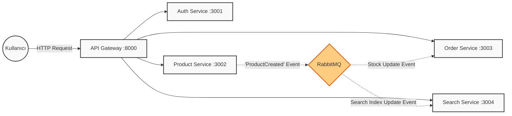

# MicroService Ecommerce Mini API

Bu proje, modern yazılım geliştirmede sıklıkla kullanılan **Microservice Mimarisi**'nin temel prensiplerini, avantajlarını ve iletişim modellerini uygulamalı olarak gösteren kapsamlı bir eğitim projesidir. Karmaşık iş kurallarına boğulmadan, servislerin birbiriyle nasıl konuştuğuna, veri tutarlılığının nasıl sağlandığına ve sistemin nasıl ölçeklendiğine odaklanılmıştır.

## 🏗️ Mimari Yapı ve Bileşenler

Proje, her biri kendi sorumluluk alanına sahip, izole edilmiş ve bağımsız olarak dağıtılabilen 4 ana microservice ve bunları destekleyen altyapı bileşenlerinden oluşur.

### 1. API Gateway (Köprü)
*   **Port:** `8000`
*   **Görevi:** Sistemin dış dünyaya açılan tek kapısıdır. İstemciler (Web, Mobil) servislerle doğrudan konuşmaz, sadece Gateway'i bilirler.
*   **İşleyişi:** Gelen HTTP isteklerini karşılar ve isteğin path'ine göre (`/auth`, `/products` vb.) ilgili servise yönlendirir (Reverse Proxy). Bu sayede servislerin IP adresleri veya portları değişse bile istemci bundan etkilenmez.

### 2. Auth Service (Kimlik Doğrulama)
*   **Port:** `3001`
*   **Veritabanı:** MongoDB (Auth DB)
*   **Görevi:** Kullanıcı yönetimi.
*   **Detay:**
    *   Kullanıcılar kayıt olur ve giriş yapar.
    *   Giriş başarılı olduğunda güvenli bir **JWT (JSON Web Token)** üretir.
    *   Diğer servisler bu token'ı doğrulayarak işlemi yapan kişinin kim olduğunu anlar.

### 3. Product Service (Ürün Yönetimi)
*   **Port:** `3002`
*   **Veritabanı:** MongoDB (Product DB)
*   **Görevi:** Ürünlerin oluşturulması, güncellenmesi ve listelenmesi.
*   **Önemli Rolü (Producer):** Bu servis, sistemdeki "Olay Başlatıcı" rolündedir. Örneğin yeni bir ürün eklendiğinde, bu veriyi sadece kendi veritabanına yazmakla kalmaz, aynı zamanda RabbitMQ'ya bir **"Ürün Eklendi"** haberi (Event) gönderir.

### 4. Order Service (Sipariş Yönetimi)
*   **Port:** `3003`
*   **Veritabanı:** MongoDB (Order DB)
*   **Görevi:** Sipariş oluşturma ve yönetimi.
*   **Önemli Rolü (Consumer):** RabbitMQ'yu dinler. Bir ürün satıldığında veya stok güncellendiğinde, bu değişikliklerden haberdar olur ve kendi içindeki tutarlılığı sağlar.

### 5. Search Service (Arama Motoru)
*   **Port:** `3004`
*   **Veritabanı:** Redis (In-Memory Cache)
*   **Görevi:** Yüksek performanslı ürün arama.
*   **Neden Ayrı?** Arama işlemleri veritabanını çok yorar. Bu servis, ürün verilerini RAM üzerinde (Redis) tutarak milisaniyeler içinde arama yapılmasını sağlar.
*   **Senkronizasyon:** Product servisine bir ürün eklendiğinde, RabbitMQ üzerinden gelen mesajı yakalar ve ürünü Redis'e kaydeder. Böylece ana veritabanı ile önbellek her zaman senkronize kalır.

---

## 🔄 Servisler Arası İletişim (Event-Driven Architecture)

Aşağıdaki şema, servislerin birbiriyle nasıl konuştuğunu (Event-Driven Architecture) özetlemektedir:



Bu yapı sayesinde, Search servisi o an çalışmıyor olsa bile, RabbitMQ mesajı saklar. Search servisi ayağa kalktığında mesajı alır ve kendini günceller. **Veri kaybı yaşanmaz.**

---

## 🛠️ Teknoloji Yığını

*   **Node.js & Express:** Tüm servislerin backend çatısı.
*   **Docker:** Her servisin (Node app, MongoDB, Redis, RabbitMQ) kendi konteynerinde izole çalışması için.
*   **Docker Compose:** 8-9 farklı konteyneri tek bir `docker-compose up` komutuyla yönetmek için.
*   **RabbitMQ:** Servisleri birbirine bağlayan Mesaj Kuyruğu (Message Broker).
*   **Redis:** Verilere ışık hızında erişmek için kullanılan Anahtar-Değer deposu.
*   **MongoDB:** Esnek ve ölçeklenebilir NoSQL veritabanı.

---

## 🚀 Kurulum ve Çalıştırma

Bilgisayarınızda **Docker Desktop**'ın yüklü ve çalışıyor olması yeterlidir.

1.  Projeyi klonlayın veya indirin.
2.  Proje ana dizininde terminal açın.
3.  Uygulamayı başlatın:

```bash
docker-compose up --build
```

### Test Etme

Sistem ayağa kalktığında **API Gateway (http://localhost:8000)** üzerinden tüm servislere erişebilirsiniz.

*   **Auth:** `POST http://localhost:8000/auth/register`
*   **Product:** `POST http://localhost:8000/products` (Eklediğiniz ürün otomatik olarak Search servisine de gidecektir)
*   **Search:** `GET http://localhost:8000/search?q=laptop`
